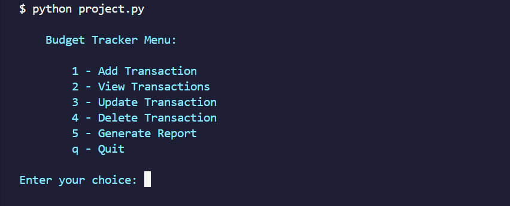
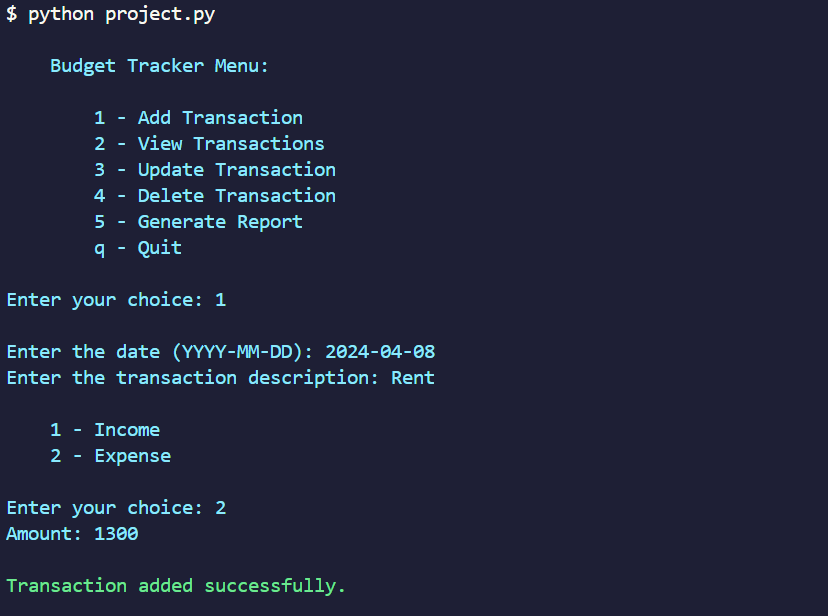
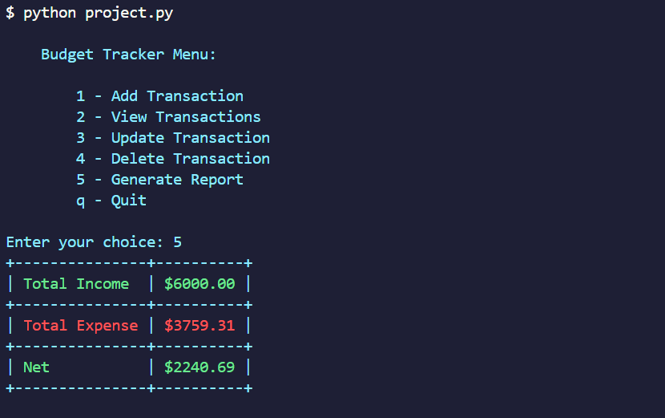

# Budget Tracker

#### Video Demo:

## Description

The Budget Tracker App is a command-line application designed to help users manage their personal finances with ease. It allows for tracking income and expenses over time, providing a clear overview of financial health. Users can add, view, update, and delete transactions, as well as generate detailed financial reports to understand their spending habits better. This application leverages Python and several third-party libraries, including Colorama for colored terminal output and Tabulate for formatting tables, to create a user-friendly interface.

## Table of Contents

- [Installation](#installation)
- [Usage](#usage)
- [Mock-Up](#mock-up)
- [License](#license)
- [Contributing](#contributing)

## Installation

This application requires Python 3.6 or newer and pip for managing dependencies. Follow these steps to set it up on your system:

- Ensure Python 3.6+ and pip are installed on your machine.
- Clone this repository to your local machine.
- Install the required dependencies by running `pip install -r requirements.txt` in the project directory.
- The application depends on external libraries such as `colorama` and `tabulate`. Ensure they are installed by executing 
`pip install colorama tabulate`.

## Usage

Navigate to the project directory in your terminal and run the application with `python project.py`. Follow the interactive menu to manage your transactions:

##### Main Menu

- The main menu provides options to add, view, update, delete transactions, generate reports, or quit the application.
- Select an option by entering the corresponding number or letter and follow the prompts.

##### Adding a Transaction

- Choose `Add Transaction` from the main menu.
- Enter the date, description, type (income or expense), and amount for the new transaction.

##### Viewing Transactions

- Select `View Transactions` to display all recorded transactions, including their IDs, dates, descriptions, types, and amounts.

##### Updating a Transaction

- Choose `Update Transaction`, then enter the ID of the transaction you wish to update.
- Follow the prompts to update the date, description, type, or amount.

##### Deleting a Transaction

- Select `Delete Transaction`, enter the ID of the transaction you wish to delete, and confirm the deletion.

##### Generating Reports

- Choose `Generate Report` to view a summary of total income, expenses, and the net amount.

## Mock-Up

Here are some terminal snapshots showing the application in use:

##### Main Menu

##### Adding a Transaction

##### Transaction Report

## License

This project is open-sourced and freely available for personal and educational use.

## Contributing
